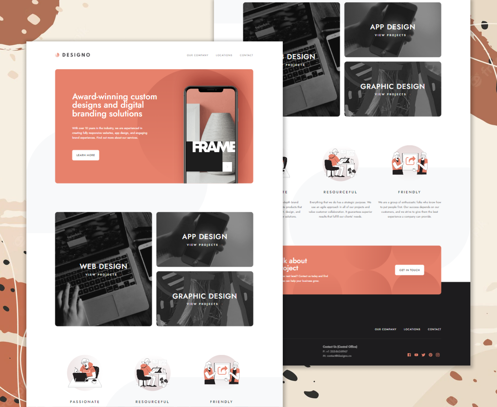

# Frontend Mentor - Designo agency website solution



## Table of contents

- [Overview](#overview)
  - [The challenge](#the-challenge)
  - [Links](#links)
- [My process](#my-process)
  - [Built with](#built-with)
  - [What I learned](#what-i-learned)
  - [Useful resources](#useful-resources)
- [Author](#author)

## Overview

### The challenge

Users should be able to:

- View the optimal layout for each page depending on their device's screen size
- See hover states for all interactive elements throughout the site
- Receive an error message when the contact form is submitted if:
  - The `Name`, `Email Address` or `Your Message` fields are empty should show "Can't be empty"
  - The `Email Address` is not formatted correctly should show "Please use a valid email address"
- **Bonus**: View actual locations on the locations page maps (we recommend [Leaflet JS](https://leafletjs.com/) for this)

### Links

- Solution URL: [Solution](https://github.com/hamilton-i7/designo)
- Live Site URL: [Live site](https://your-live-site-url.com)

## My process

### Built with

- Semantic HTML5 markup
- Flexbox
- Mobile-first workflow
- [React](https://reactjs.org/) - JS library
- [Next.js](https://nextjs.org/) - React framework
- [MUI](https://mui.com/) - For styles
- [Google Maps API](https://developers.google.com/maps) - For intercative maps

### What I learned

This was my first time integrating Google Maps to a website. To my surprise, it was a very easy thing to do.

```jsx
import { GoogleMap, useLoadScript, MarkerF } from '@react-google-maps/api'

const Map = ({ center }) => {
  const theme = useTheme()
  const matchesSmallScreen = useSmallScreenMatcher(theme)
  const matchesDesktopScreen = useDesktopScreenMatcher(theme)

  return (
    <GoogleMap
      zoom={15}
      center={center}
      mapContainerStyle={{
        width: '100%',
        height: matchesSmallScreen ? '32.6rem' : '32rem',
        borderRadius: matchesSmallScreen ? '1.5rem' : 0,
        maxWidth: matchesDesktopScreen ? '35rem' : 'initial',
      }}>
      <MarkerF position={center} />
    </GoogleMap>
  )
}

const DesignoMap = ({ lat, lng }) => {
  const center = useMemo(() => ({ lat, lng }), [lat, lng])
  const { isLoaded } = useLoadScript({
    googleMapsApiKey: process.env.NEXT_PUBLIC_GOOGLE_MAPS_API_KEY,
  })

  if (!isLoaded) return <Loader show={isLoaded} />
  return <Map center={center} />
}
```

### Useful resources

- [What is Open Graph and how can I use it for my website?](https://www.freecodecamp.org/news/what-is-open-graph-and-how-can-i-use-it-for-my-website/) - This article helped to understand the basics of open graphs and how to use them to improve your website's SEO performance.
- [How to load Maps JavaScript API in React](https://www.youtube.com/watch?v=9e-5QHpadi0) - This video helped me to integrate Google Maps to the website.

## Author

- Frontend Mentor - [@hamilton-i7](https://www.frontendmentor.io/profile/hamilton-i7)
- Twitter - [@hamilton_i7](https://twitter.com/hamilton_i7)
